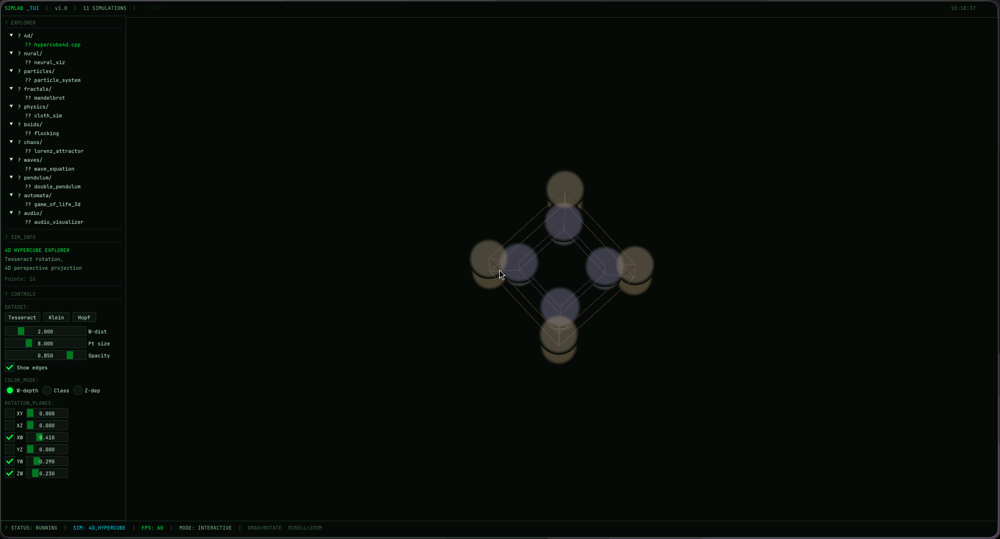
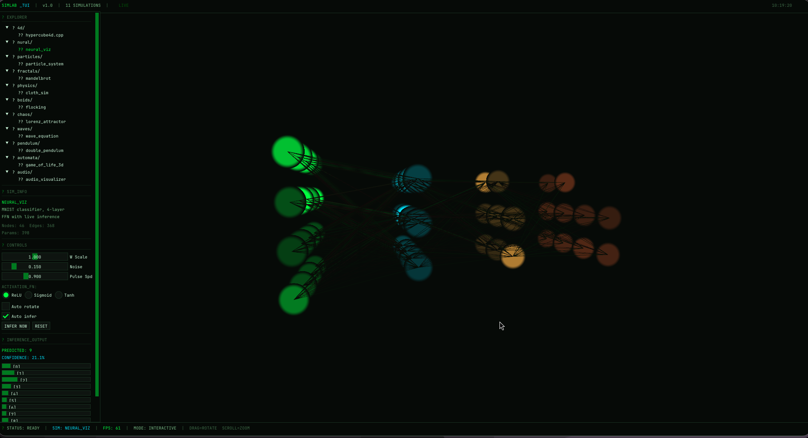
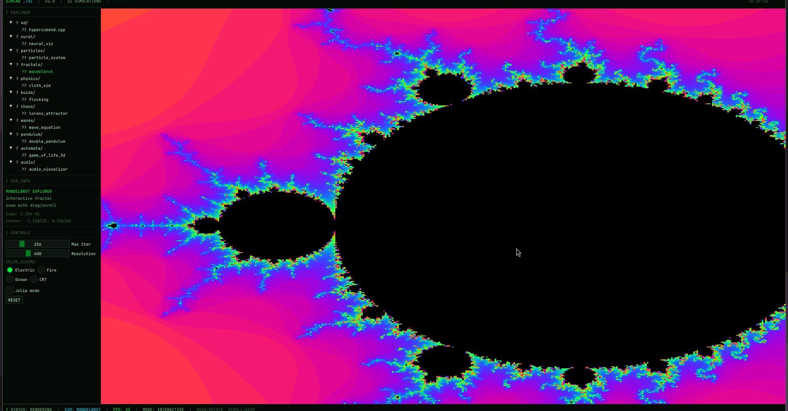
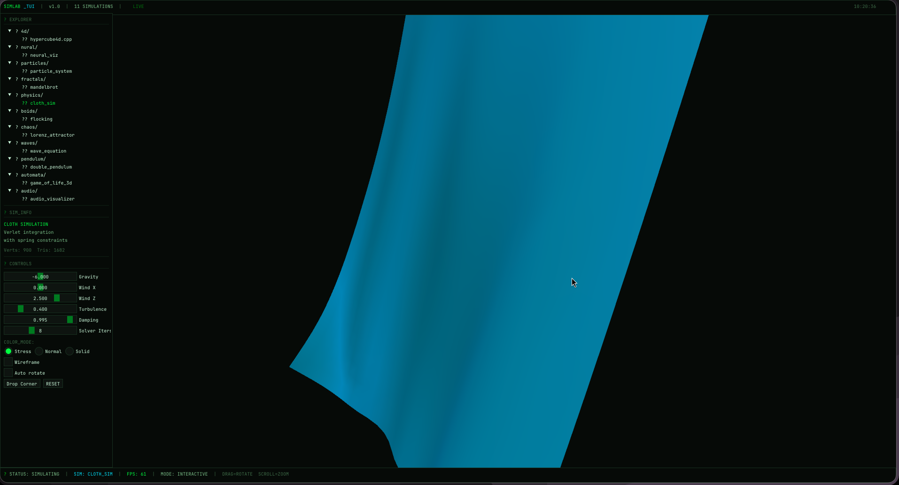
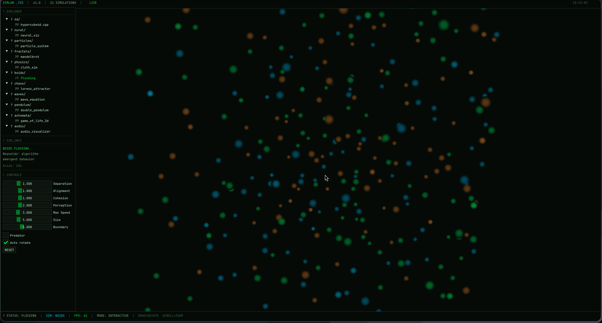
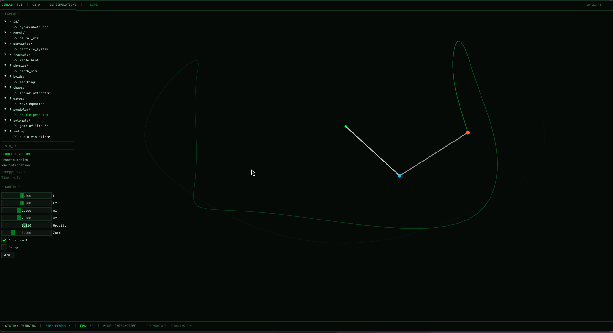
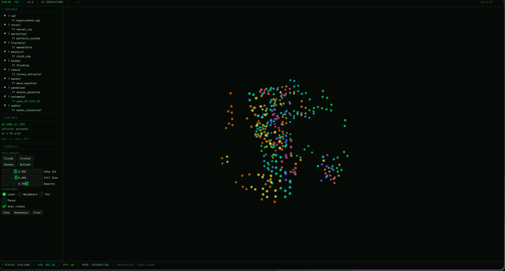

# 🌌 SimLab TUI
**11-in-1 Interactive Graphics Simulation Engine**


*A high-performance C++/OpenGL visualizer featuring a sleek, terminal-inspired ImGui browser interface.*

SimLab TUI allows real-time execution and deep interaction with **11 distinct mathematical, physical, and generative computer graphics simulations**, all running seamlessly within a single shared OpenGL context. Explore chaotic systems, cellular automata, physics simulations, and more from a unified developer-friendly interface.

---

## 📸 Showcase & Included Simulations

### 1. 🎲 4D Hypercube
Higher-dimensional geometry projection with controllable rotation planes.



### 2. 🧠 Neural Network Viz
3D visualization and animation FSM of neural network inferencing.



### 3. ✨ Particle System
GPU-accelerated particles with 4 emitter modes, gravity, wind, and life-cycling.

### 4. 🌀 Mandelbrot Explorer
Interactive fractal rendering with deep zoom, pan, Julia mode, and vibrant color profiles.



### 5. 🚩 Cloth Simulation
Verlet-based physics with structural constraints, wind turbulence, and stress visualization.



### 6. 🦅 Boids Flocking
Reynolds' artificial life algorithm demonstrating emergent separation, alignment, and cohesion.



### 7. 🌪️ Lorenz Attractor
Strange attractors and chaos theory visualization with 3D trail rendering.

### 8. 💧 Wave Equation
2D PDE simulated on a heightmap mesh with rain, drops, and slit source modes.

### 9. ⏳ Double Pendulum
RK4-integrated chaotic dynamics system displaying breathtaking orbital trail history.



### 10. ⬛ Game of Life 3D
Cellular automata computed across a 3D grid with adjustable survival/birth rules.



### 11. 🎵 Audio Visualizer
Real-time microphone capture with FFT spectrum bars, circular, and spectrogram modes.

---

## 🔜 Coming Soon
Development is highly active! Expect frequent updates as more exciting mathematical models, rendering techniques, and physics simulations are continually being added to the engine. Stay tuned!

---

## ⚙️ Requirements

Before building the project, ensure your system meets the following exact requirements:

*   **Compiler:** GCC / Clang / Apple Clang (Must support standard **C++20**)
*   **Build System:** CMake 3.20 or newer
*   **Libraries:** OpenGL, GLFW3, GLEW, GLM, PulseAudio (`libpulse`)
*   *Note: ImGui is downloaded and linked automatically by CMake during the build process via `FetchContent`.*

---

## 🚀 Building & Running

### 🐧 Linux (Arch / Ubuntu / Debian)

**1. Install System Dependencies:**

**For Arch / Manjaro / CachyOS:**
```bash
sudo pacman -S cmake base-devel glfw-x11 glew glm pulseaudio
# Note: You can use `glfw-wayland` instead of `glfw-x11` if you are running exclusively on Wayland.
```

**For Ubuntu / Debian / Pop!_OS:**
```bash
sudo apt update
sudo apt install cmake build-essential libglfw3-dev libglew-dev libglm-dev libpulse-dev
```

**2. Build & Execute:**
```bash
# Clone the repository if you haven't already
mkdir -p build
cd build

# Configure the project
cmake .. -DCMAKE_BUILD_TYPE=Release

# Build using all available CPU threads
make -j$(nproc)

# Run the simulation engine
./simlab_tui
```

### 🍏 macOS

**1. Install Dependencies (via [Homebrew](https://brew.sh/)):**
```bash
brew install cmake glfw glew glm pulseaudio pkg-config
```

**2. Configure PulseAudio Configuration (First time only):**
Since macOS uses CoreAudio natively, PulseAudio needs to be started as a daemon to capture audio for the FFT visualizer:
```bash
pulseaudio --start
```

**3. Build & Execute:**
```bash
mkdir -p build
cd build

# Configure the project
cmake .. -DCMAKE_BUILD_TYPE=Release

# Build using all available CPU threads
make -j$(sysctl -n hw.ncpu)

# Run the simulation engine
./simlab_tui
```

---

## 🕹️ Controls & Navigation

*   **📁 File Explorer (Left Sidebar):** Click any directory/file to load its respective simulation engine in the main viewport.
*   **🎛️ Control Panel:** Expand the settings panel under the explorer to tweak physics, speeds, colors, and specific simulation variables dynamically.
*   **🎥 Camera Orbit:** `Left-Click` & `Drag` to rotate the camera around 3D simulations.
*   **🔍 Camera Zoom:** `Scroll Wheel` to zoom in and out.

---

## 👨‍💻 Developer & Maintainer

**Developed by:** [@swadhinbiswas](https://github.com/swadhinbiswas)  
**Email:** swadhinbiswas.cse@gmail.com  

If you found this project interesting, feel free to drop a ⭐ on the repository!
